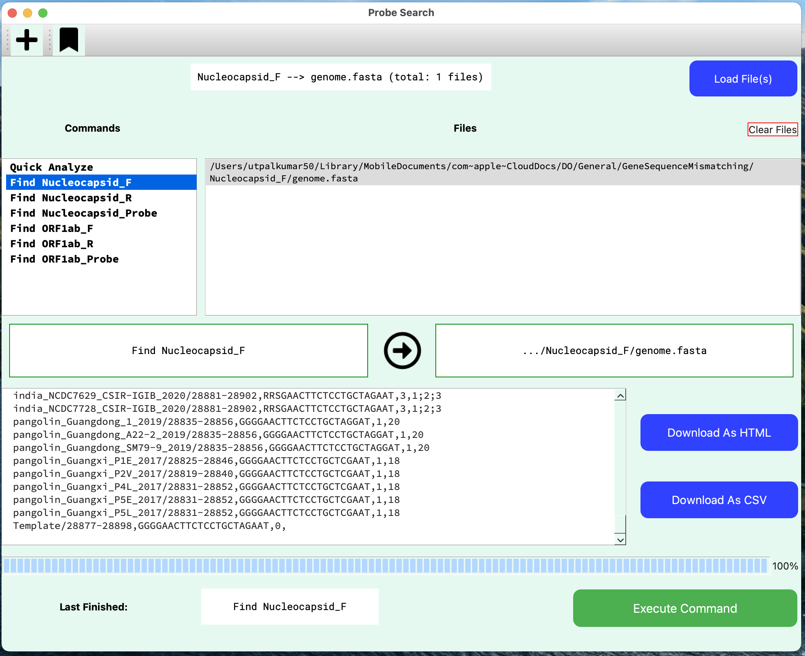

## Probe Search

-   Download Windows executable [`ProbeSearchWindows`](https://drive.google.com/file/d/1N8NBgGfMq4hsjp6-nC60fwW7fa6lDsDo/view?usp=sharing)

    

-   Read fasta file and search for the predefined probe with maximum of 5 differences

For comments and feedback, please write to me: utpalkumar50@gmail.com

## How to use?

<iframe width="560" height="315" src="https://www.youtube.com/embed/4LkdwBZASE0" title="YouTube video player" frameborder="0" allow="accelerometer; autoplay; clipboard-write; encrypted-media; gyroscope; picture-in-picture" allowfullscreen></iframe>